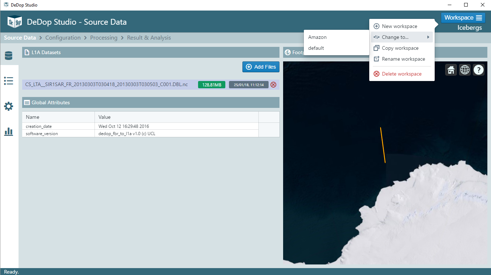

.. DeDop documentation master file, created by
   sphinx-quickstart on Mon Nov 23 11:31:59 2015.
   You can adapt this file completely to your liking, but it should at least
   contain the root `toctree` directive.

|DeDop3| - a User Configurable Tool for Processing Delay Doppler Altimeter Data
================================================================================

.. toctree::
   :caption: Table of Contents
   :maxdepth: 1
   :numbered:

   introduction
   quickstart
   user_manual
   faq
   api_reference

Indices and Tables
==================

* :ref:`genindex`
* :ref:`modindex`
* :ref:`search`

.. |DeDop3| replace:: DeDop\ :sup:`3`
