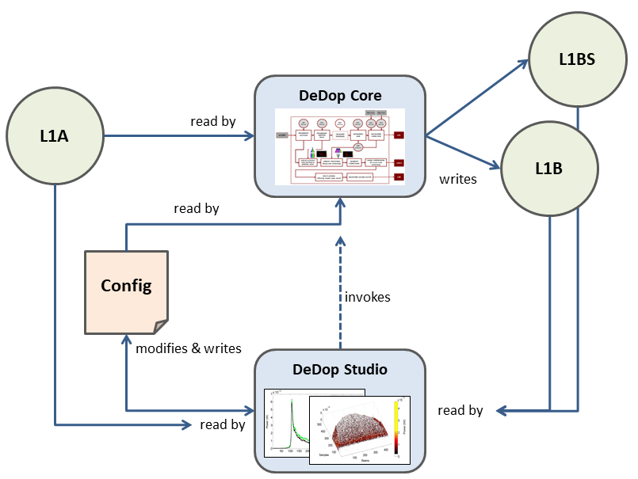

.. |DeDop3| replace:: DeDop\ :sup:`3`

============
Introduction
============

*DeDop: a User Configurable Tool for Processing Delay Doppler Altimeter Data.*

Delay Doppler Altimeter Data
============================

The recent development of SAR altimetry, or more properly Delay Doppler altimetry, as first
implemented on CryoSat-2 and now also operated on Sentinel-3, opens an exciting new era for
the scientific community. This new approach offers to scientists an opportunity to develop new
processing schemes and derive new and improved products, and so maximise the benefits
of the measurements available from upcoming missions.
Historically, in conventional altimetry, the understanding of the Level 1b processor was the
responsibility of the instrument engineers with system expertise. This was logical as the
subsequent levels of processing only needed the results produced by the Level 1b processor
(Level 1b product) and the information contained in it. There were not many different correct ways
of processing the raw data up to Level 1b.

However, this approach is no longer appropriate for SAR Altimetry or Altimeter Delay Doppler
Processing. The links between the Level 1B processing and the Level 2 processing, particularly the
retracking of the waveforms, are very strong. For instance, different ways of performing the delay
Doppler processing lead to different L1B waveform shapes,and peculiarities of the *Delay Doppler
Processor* (DeDop processor) have a noticeable effect on the L1B waveform leading to changes in the
geophysical retrievals.

Due to this strong link between the Level 1b processing and the final geophysical retrievals, it is
important that the SAR Altimetry scientific community gains a much better understanding the Level
1B processor, and is involved in new developments. For various reasons (e.g. the novelty of the
processing, previous unavailability of adequate documentation, restricted availability of the low
levels of data), this understanding is currently limited, both in general terms of what a DeDop processor is, and
in the different options chosen for the different missions.

The |DeDop3| Project
====================

The |DeDop3| project provides the scientific community with the means to understand and use low
level altimetry data and to become involved in how these data are processed. This is achieved by
providing them with a Fully Adaptable and Configurable DeDop and a friendly user interface (a tool)
to help them to interact with DeDop processor. The proposed DeDop has different options from which the user
will be able to choose according to their particular field of interest. Examples of the new options
are: surface focusing (particularly relevant for special targets like coasts, rivers or lakes), any kind
of weighting along and across track, different azimuth processing approaches, stack masking, new
stacking algorithms (e.g. ACDC), Sigma-0 at stack level, etc.

DeDop is open source and available in such a way that users are able to explore the code, understand its possibilities,
and to modify it to their own needs.

The tool also comes with various demonstrations of new features that can be investigated and
retrieved when using these lower data processing levels. They are presented as successful case
studies.

The DeDop Tool
==============

The DeDop tool comprises both a command-line interface, the *DeDop Shell*, and a graphical user interface,
the *DeDop Studio*. The tool's primary goal is to make it easy to configure and run and to provide
a number of analysis functions to inspect and compare the L1B results. The tool’s target users are community
scientists wishing to learn, modify or extend the DeDop processor configuration and/or code and then use the tool for
comparisons between outputs of varying configurations generated by the DeDop.

.. _dedop_diagram:

   The DeDop and the Tool context

The image above shows two components: DeDop Studio and DeDop Core. DeDop Core consists of **DeDop processor**, **DeDop Shell**,
and **DeDop webapi**. With DeDop Shell, users will be able to do all the operations using a command-line interface. Information
on how to use DeDop Shell can be found in :doc:`user_manual/um_shell`. With DeDop Studio, users can also perform the same
operations as in DeDop Shell (modifies & writes config, read L1A data, etc.) and in the end it invokes DeDop processor in
DeDop Core via the webapi interface. More information about DeDop Studio can be found in :doc:`user_manual/um_studio`.

