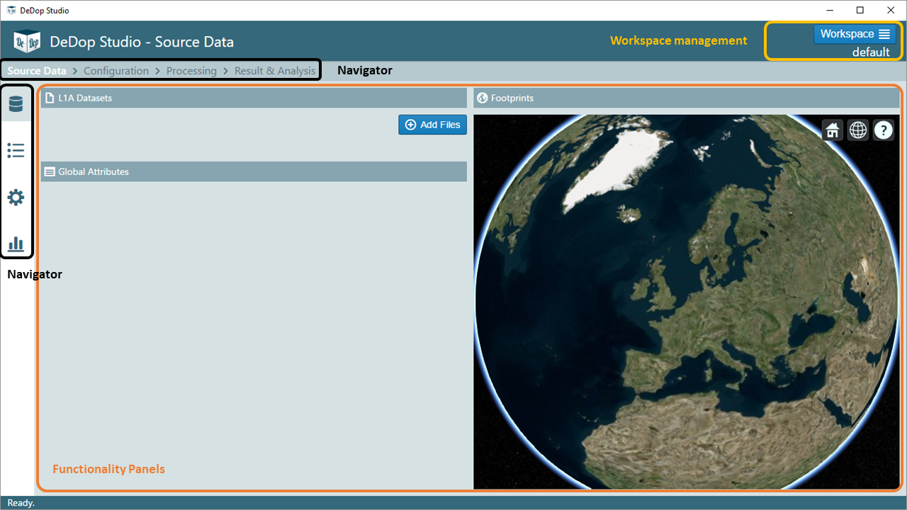
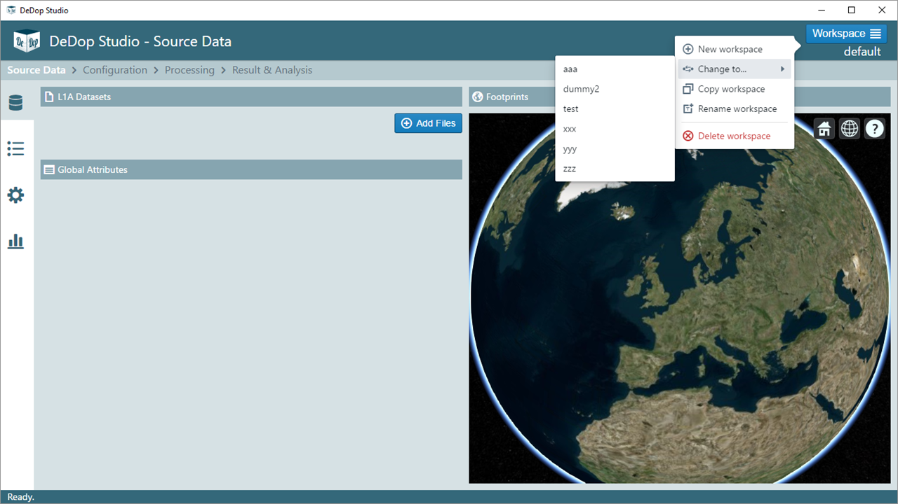
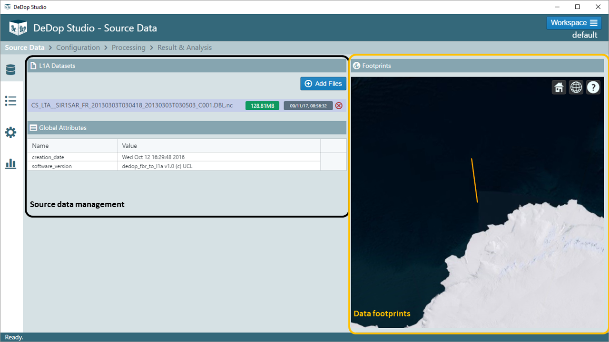
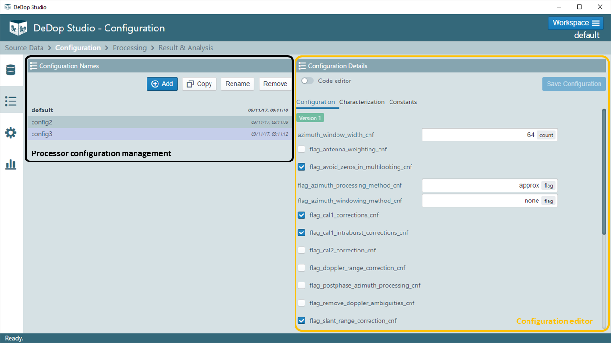
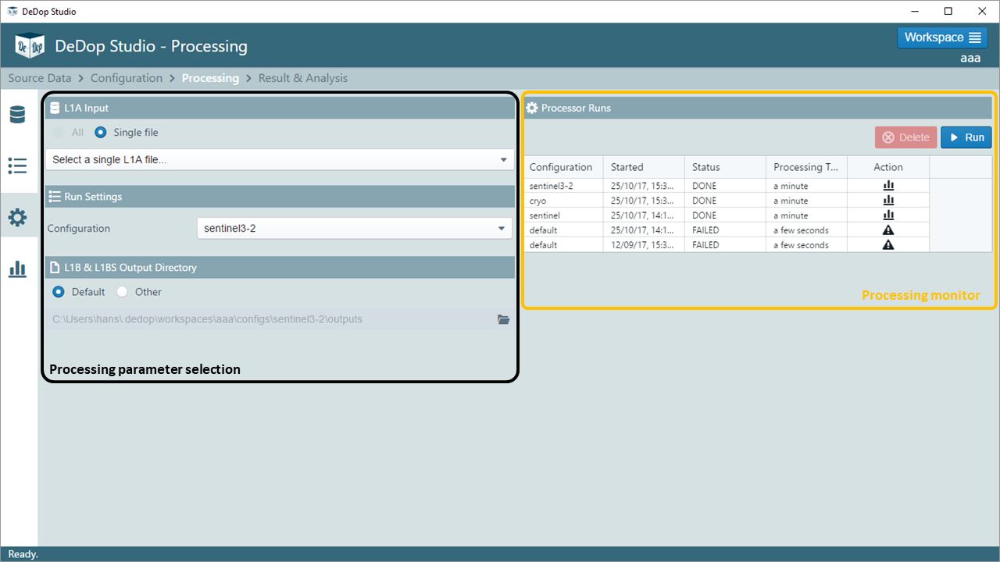
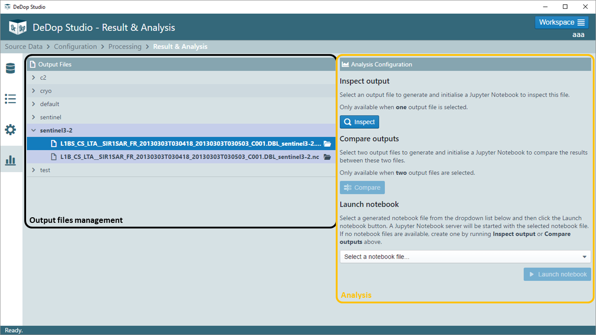

=============
DeDop Studio
=============

.. _studio_intro:

DeDop Studio is a desktop application with a primary aim of providing a user-friendly experience for processing L1A files.
It was designed based on the already-existing :doc:`um_shell`, so the behavior is almost the same with its command line counterpart.
In order to be able to use DeDop Studio, one must have a specific version of DeDop Core installed. The table below shows
the dependency information between DeDop Core and DeDop Studio.

=============  =========================
DeDop Studio    ...depends on DeDop Core
=============  =========================
   v1.2.0            v1.2.0
   v1.1.0            v1.1.0
   v1.0.0            v1.0.0
=============  =========================

The image below shows the first screen of DeDop Studio. At the top there is a screen title that will be updated once the
user navigates to another screen. On the right side of this top section, there is a section for **Workspace management**.
This is the area where user can perform workspace-related operations, such as adding, removing, copying, renaming, changing,
and deleting a workspace. Right under the screen title, there are breadcrumbs showing the available four screens of this
application. They also correspond to the four icons that are lined up vertically on the left side of the screen. These
components act as the **navigator** of the application, to give the user an idea on where he/she is in the application,
and also in the workflow. Both the workspace management and the navigator are components that are static, which means they
will be visible on all the screens. **Functionality panels**, on the other hand, is the main area of the application where
users can interact and it will change depending on which screen is selected.

.. _workspace_manag_studio:

Workspace Management
====================

Clicking the blue Workspace button at the top right will display a workspace management popover menu. With this menu, one
can perform workspace-related operations. Under this button, the current workspace name is displayed. For example, from
the image above, we can see that the current workspace is **default**.

What happened behind the scene when any workspace-related operations (in fact, most of the operations) are triggered at
DeDop Studio is that it makes some modifications on ``.dedop`` directory, as the case in DeDop Shell.

.. _source_file_manag_studio:

L1A Source File Management
==========================

On the **Source Data** screen, there are three panels: L1A Datasets, Global Attributes, and Footprints. In **L1A Datasets**
panel, initially users can add an L1A file into the current workspace. Clicking the ``Add Files`` button will open
a file selector window, using which the user can select a single file from the file system. When the adding process is
finished, the newly-added file, together with all previously-added files, will be displayed as a list. When a single file
is clicked, the **Global Attributes** panel will display the global attributes of the netCDF file. At the same time,
**Footprints** panel will display the footprints of the selected netCDF file in a Cesium globe. Note that this display on
the globe is only possible when the source file is a conformant L1A data.

One more thing that happens when a file is selected is that, DeDop Studio stores this information and this will be selected
as the default file (although still changeable) when a process is about to be started. This is explained in more detail in
:ref:`Processing Screen <run_proc_studio>`.

.. _config_manag_studio:

Processor Configuration Management
==================================

There are two panels in **Configuration** screen: Configuration Names and Configuration Details. In
**Configuration Names** panel, users can do configuration-related operations such as add, copy, rename, remove, or change
the current configuration. Single-clicking a configuration name on the list will display the contents of that particular
configuration on **Configuration Details** panel. To select a configuration as the current configuration, double-click it.
Another way is to select it from the drop-down list in **Run Settings** panel inside
:ref:`Processing Screen <run_proc_studio>`.

In **Configuration Details** panel, users can modify the configuration files in two ways: using HTML components or using
code editor. In HTML mode, configuration items are listed in a form appearance either as a label-texinput (when the
expected value is of type number or string) or a checkbox (when the expected value is of type boolean). When the code editor
mode is active (by activating ``Code editor`` toggle at the top), a JSON code editor will appear. Here, users can
modify the values of the configurations in JSON format.

In both modes, as soon as a value has been changed, the ``Save Configuration`` button is enabled. Click this button if
the change(s) is to be made, otherwise this change(s) will not be reflected on the actual configuration files.

By default (in DeDop Studio v1.2.0), the modification of ``Characterization`` and ``Constants`` configurations are disabled.
You will notice that under these tabs, the HTML elements are disabled and the Code Editor is read-only.

.. _run_proc_studio:

Running the Processor
=====================

There are 4 panels under **Processing** screens: L1A Input, Run Settings, L1B & L1BS Output Directory, and Processor Runs.
The first two panels form a summary on which L1A dataset and which configuration the users have chosen on **Source Data**
and **Configuration** screens, respectively. A small note on **L1A Input** panel: at the moment only processing of single
files are available. In **L1B & L1BS Output Directory**, users can select another output directory for the product results.

To initiate a processing, click ``Run`` button inside **Processor Runs** panel. DeDop Studio will check whether all the
required parameters (input file, configuration, and output directory) have been selected. When any of them are missing,
a dialog box will pop up with the information on which field you have to fill up. Otherwise, the processing will be started,
marked by a new entry on the table. You can monitor the progress of the processing and at the moment, because the tool is
capable only running one process at a time, the ``Run`` button is blocked, displayed as a spinner, as long as a process
is running.

In the end, a process can either be successful or fail. This status is indicated by the icon under ``Action`` column on
the table in **Processor Runs** panel. On the image above, for example, the first three rows indicate that the processes
are successful and when icon is clicked, the page will transition to screen 4,
:ref:`Result & Analysis <analyse_l1b_studio>`. In the case of failure, mouse over on the icon to show a short description
of the error as a tooltip text.

When DeDop Studio is closed, the information in the table is preserved, by storing the data into ``dedop-prefs.json``.
During the next startup of DeDop Studio, this information is loaded and used to populate the table.

.. _analyse_l1b_studio:

Analysing L1B Results
=====================

The purpose of this screen is to manage what to do with the result products after a processing. There are two panels:
Output Files and Analysis Configuration. In **Output Files**, users can navigate to different output files in the current
workspace directory, grouped by configurations. By clicking a file name, the said file is selected. This has an implication
on which actions are available, depending on how many files are selected. If only one file is selected, the ``Inspect``
button on **Analysis Configuration** panel is enabled. When two files are selected, the ``Compare`` button is enabled.
Clicking one of these buttons will trigger a creation of a Jupyter notebook suitable for inspecting or comparing the
file(s) that have been selected, and to start a local instance of Jupyter notebook server. This behavior is consistent
with DeDop Shell command :ref:`dedop output compare/inspect <analyse_results>`. The dropdown list at the bottom of
**Analysis Configuration** is used to select a notebook file that has been previously created through ``Inspect`` and
``Compare`` buttons.
